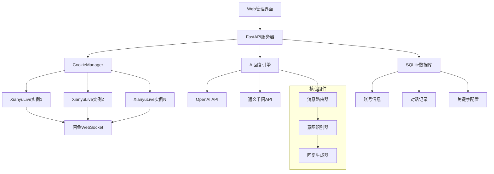

# 闲鱼多账号自动回复系统 (xianyu-auto-reply)

<div align="center">


**一个功能强大的闲鱼多账号管理和自动回复系统**

支持多账号管理 | Web 界面控制 | AI 智能回复 | 关键字匹配 | 实时监控

</div>

---

## 📋 目录

- [项目概述](#-项目概述)
- [核心特性](#-核心特性)
- [系统架构](#-系统架构)
- [环境配置](#-环境配置)
- [快速开始](#-快速开始)
- [核心代码解析](#-核心代码解析)
- [Web 管理界面](#-web管理界面)
- [AI 回复引擎](#-ai回复引擎)
- [典型应用场景](#-典型应用场景)
- [常见问题解答](#-常见问题解答)
- [高级配置](#-高级配置)

---

## 🎯 项目概述

### 什么是闲鱼多账号自动回复系统？

这是一个基于 **FastAPI + WebSocket + AI** 的现代化闲鱼自动回复解决方案，专为电商卖家设计。

**核心价值**：

- 🚀 **效率提升**：支持多个闲鱼账号同时运行，24 小时自动回复
- 🧠 **智能回复**：集成 OpenAI/通义千问等 AI 模型，提供个性化回复
- 🎛️ **可视化管理**：Web 界面实时监控，账号状态一目了然
- 🔧 **灵活配置**：关键字匹配、AI 回复、人工接管多种模式

**技术类比**：

```
传统人工客服    →    自动回复系统
单账号管理      →    多账号集中管理
固定回复模板    →    AI智能生成回复
手动监控        →    Web界面实时监控
```

---

## ✨ 核心特性

### 🏢 多账号管理

- **并发处理**：同时管理多个闲鱼账号
- **状态监控**：实时显示每个账号的在线状态
- **独立配置**：每个账号可设置不同的回复策略

### 🤖 智能回复系统

- **AI 回复**：支持 OpenAI、通义千问等主流 AI 模型
- **意图识别**：自动识别价格咨询、技术问题、一般咨询
- **上下文理解**：基于对话历史生成连贯回复
- **议价控制**：智能议价策略，防止过度优惠

### 🎯 关键字匹配

- **精确匹配**：支持关键字 → 固定回复映射
- **优先级控制**：关键字回复优先于 AI 回复
- **批量管理**：Web 界面批量编辑关键字

### 🌐 Web 管理界面

- **实时监控**：账号状态、消息统计、回复效果
- **配置管理**：AI 参数、关键字、账号设置
- **日志查看**：实时日志流、错误追踪
- **数据导出**：对话记录、统计报表

---

## 🏗️ 系统架构

### 整体架构图



### 数据流向

```
用户消息 → WebSocket接收 → 消息解析 → 意图识别 → 回复策略选择 → 生成回复 → 发送回复
    ↓           ↓           ↓         ↓         ↓           ↓         ↓
 原始数据   MessagePack   结构化    AI分类    关键字/AI    文本生成   WebSocket
```

---

## 🛠️ 环境配置

### 系统要求

| 组件   | 最低版本 | 推荐版本 | 说明             |
| ------ | -------- | -------- | ---------------- |
| Python | 3.8+     | 3.9+     | 支持异步编程特性 |
| 内存   | 2GB      | 4GB+     | 多账号并发需要   |
| 存储   | 1GB      | 5GB+     | 日志和数据库存储 |
| 网络   | 稳定网络 | 高速网络 | WebSocket 长连接 |

### 依赖安装

**1. 克隆项目**

```bash
git clone https://github.com/your-repo/xianyu-auto-reply.git
cd xianyu-auto-reply
```

**2. 创建虚拟环境**

```bash
# 创建虚拟环境
python -m venv venv

# 激活虚拟环境
# Windows:
venv\Scripts\activate
# macOS/Linux:
source venv/bin/activate
```

**3. 安装依赖**

```bash
pip install -r requirements.txt
```

**核心依赖说明**：

```python
fastapi>=0.68.0        # Web框架，提供API和管理界面
uvicorn>=0.15.0        # ASGI服务器，运行FastAPI应用
websockets>=10.0       # WebSocket客户端，连接闲鱼服务器
openai>=1.0.0          # OpenAI API客户端
loguru>=0.6.0          # 日志管理，提供结构化日志
pydantic>=1.8.0        # 数据验证，确保API数据格式正确
aiofiles>=0.7.0        # 异步文件操作
pandas>=1.3.0          # 数据处理，用于导出功能
```

### 配置文件设置

**1. 创建全局配置文件**

```bash
cp global_config.yml.example global_config.yml
```

**2. 编辑配置文件**

```yaml
# global_config.yml
WEBSOCKET_URL: 'wss://wss-goofish.dingtalk.com/'
HEARTBEAT_INTERVAL: 15
TOKEN_REFRESH_INTERVAL: 3600

AUTO_REPLY:
  enabled: true
  default_message: '亲爱的老板你好！所有宝贝都可以拍，秒发货的哈~'
  api:
    enabled: true
    host: '0.0.0.0'
    port: 8080
    timeout: 10

LOG_CONFIG:
  level: 'INFO'
  rotation: '1 day'
  retention: '7 days'
```

**配置项详解**：

| 配置项                   | 类型   | 默认值                          | 说明                      |
| ------------------------ | ------ | ------------------------------- | ------------------------- |
| `WEBSOCKET_URL`          | string | wss://wss-goofish.dingtalk.com/ | 闲鱼 WebSocket 服务器地址 |
| `HEARTBEAT_INTERVAL`     | int    | 15                              | 心跳包发送间隔（秒）      |
| `TOKEN_REFRESH_INTERVAL` | int    | 3600                            | Token 刷新间隔（秒）      |
| `AUTO_REPLY.enabled`     | bool   | true                            | 是否启用自动回复          |
| `AUTO_REPLY.api.host`    | string | 0.0.0.0                         | Web 服务绑定地址          |
| `AUTO_REPLY.api.port`    | int    | 8080                            | Web 服务端口              |

---

## 🚀 快速开始

### 启动步骤

**1. 启动主程序**

```bash
python Start.py
```

**启动过程解析**：

```python
# Start.py 启动流程
async def main():
    # 1. 初始化文件日志收集器
    setup_file_logging()

    # 2. 创建CookieManager实例
    cm.manager = cm.CookieManager(loop)

    # 3. 从数据库加载已保存的Cookie
    for cid, val in manager.cookies.items():
        if manager.get_cookie_status(cid):  # 检查账号是否启用
            # 创建异步任务运行XianyuLive
            task = loop.create_task(manager._run_xianyu(cid, val, user_id))
            manager.tasks[cid] = task

    # 4. 启动FastAPI Web服务器
    threading.Thread(target=_start_api_server, daemon=True).start()

    # 5. 保持主程序运行
    await asyncio.Event().wait()
```

**2. 访问 Web 管理界面**

```
浏览器打开: http://localhost:8080
默认账号: admin
默认密码: admin123
```

**3. 添加闲鱼账号**

通过 Web 界面添加 Cookie：

1. 登录管理界面
2. 点击"账号管理" → "添加账号"
3. 输入 Cookie 信息
4. 配置回复策略
5. 启动账号任务

### 获取 Cookie 方法

**浏览器开发者工具方法**：

1. **打开闲鱼网页版**

   ```
   访问: https://www.goofish.com/
   登录你的闲鱼账号
   ```

2. **获取 Cookie**

   ```bash
   # 按F12打开开发者工具
   # 切换到Network标签页
   # 刷新页面，找到任意请求
   # 复制Request Headers中的Cookie值
   ```

3. **Cookie 格式示例**
   ```
   Cookie: cna=xxx; isg=xxx; l=xxx; tfstk=xxx; _m_h5_tk=xxx; _m_h5_tk_enc=xxx
   ```

**重要提示**：

- Cookie 包含敏感信息，请妥善保管
- Cookie 有时效性，通常 7-30 天需要更新
- 建议使用小号进行测试

---

## 🔍 核心代码解析

### 1. 项目启动入口 (Start.py)

#### 主函数解析

```python
async def main():
    """主程序入口函数

    功能流程：
    1. 初始化日志系统
    2. 创建Cookie管理器
    3. 加载已保存的账号
    4. 启动Web服务器
    5. 保持程序运行
    """
    print("开始启动主程序...")

    # 【步骤1】初始化文件日志收集器
    # 作用：收集所有模块的日志，提供Web界面实时查看
    setup_file_logging()
    logger.info("文件日志收集器已启动，开始收集实时日志")
```

**日志系统工作原理**：

```python
# file_log_collector.py 中的实现
class FileLogCollector:
    def __init__(self):
        self.logs = deque(maxlen=1000)  # 最多保存1000条日志
        self.subscribers = set()        # WebSocket订阅者

    def add_log(self, record):
        """添加日志记录"""
        log_entry = {
            'timestamp': record.time.isoformat(),
            'level': record.level.name,
            'message': record.message,
            'module': record.name
        }
        self.logs.append(log_entry)
        # 实时推送给Web界面
        self._notify_subscribers(log_entry)
```

#### Cookie 管理器初始化

```python
# 【步骤2】创建CookieManager并在全局暴露
loop = asyncio.get_running_loop()
cm.manager = cm.CookieManager(loop)
manager = cm.manager
```

**CookieManager 类详解**：

```python
class CookieManager:
    """多账号Cookie管理器

    核心职责：
    1. 管理多个闲鱼账号的Cookie
    2. 为每个账号创建独立的XianyuLive任务
    3. 监控账号状态和任务健康度
    4. 提供账号的启用/禁用控制
    """

    def __init__(self, loop: asyncio.AbstractEventLoop):
        self.loop = loop                              # 事件循环引用
        self.cookies: Dict[str, str] = {}            # Cookie存储: {账号ID: Cookie值}
        self.tasks: Dict[str, asyncio.Task] = {}     # 任务存储: {账号ID: 异步任务}
        self.keywords: Dict[str, List[Tuple[str, str]]] = {}  # 关键字: {账号ID: [(关键字, 回复)]}
        self.cookie_status: Dict[str, bool] = {}     # 状态控制: {账号ID: 是否启用}
        self._load_from_db()                         # 从数据库加载数据
```

#### 账号任务启动逻辑

```python
# 【步骤3】为每个启用的Cookie启动任务
for cid, val in manager.cookies.items():
    # 检查账号是否启用
    if not manager.get_cookie_status(cid):
        logger.info(f"跳过禁用的 Cookie: {cid}")
        continue

    try:
        # 获取Cookie详细信息（包括绑定的用户ID）
        cookie_info = db_manager.get_cookie_details(cid)
        user_id = cookie_info.get('user_id') if cookie_info else None

        # 创建异步任务
        task = loop.create_task(manager._run_xianyu(cid, val, user_id))
        manager.tasks[cid] = task
        logger.info(f"启动数据库中的 Cookie 任务: {cid} (用户ID: {user_id})")

    except Exception as e:
        logger.error(f"启动 Cookie 任务失败: {cid}, {e}")
```

**任务创建过程详解**：

```python
async def _run_xianyu(self, cookie_id: str, cookie_value: str, user_id: int = None):
    """为单个账号创建XianyuLive实例

    Args:
        cookie_id: 账号标识符
        cookie_value: Cookie字符串
        user_id: 绑定的用户ID（可选）

    工作流程：
    1. 动态导入XianyuLive类（避免循环导入）
    2. 创建XianyuLive实例
    3. 调用main()方法开始监听消息
    4. 处理异常和任务取消
    """
    try:
        # 延迟导入，避免循环依赖
        from XianyuAutoAsync import XianyuLive

        # 创建实例，传入Cookie和账号标识
        live = XianyuLive(cookie_value, cookie_id=cookie_id, user_id=user_id)

        # 开始运行（建立WebSocket连接，监听消息）
        await live.main()

    except asyncio.CancelledError:
        logger.info(f"XianyuLive 任务已取消: {cookie_id}")
    except Exception as e:
        logger.error(f"XianyuLive 任务异常({cookie_id}): {e}")
```

### 2. 配置管理系统 (config.py)

#### 配置类设计

```python
class Config:
    """配置管理类 - 单例模式

    设计模式：单例模式
    作用：确保全局只有一个配置实例，避免重复加载

    核心功能：
    1. 从YAML文件加载配置
    2. 支持点号分隔的多级配置访问
    3. 配置的动态修改和保存
    4. 类型安全的配置获取
    """

    _instance = None    # 单例实例
    _config = {}        # 配置数据存储

    def __new__(cls):
        """单例模式实现"""
        if cls._instance is None:
            cls._instance = super(Config, cls).__new__(cls)
            cls._instance._load_config()  # 首次创建时加载配置
        return cls._instance
```

#### 配置加载机制

```python
def _load_config(self):
    """配置文件加载器

    加载流程：
    1. 定位配置文件路径
    2. 检查文件是否存在
    3. 使用YAML解析器加载
    4. 存储到内存中供快速访问
    """
    # 获取配置文件绝对路径
    config_path = os.path.join(os.path.dirname(__file__), 'global_config.yml')

    # 文件存在性检查
    if not os.path.exists(config_path):
        raise FileNotFoundError(f"配置文件不存在: {config_path}")

    # YAML文件解析
    with open(config_path, 'r', encoding='utf-8') as f:
        self._config = yaml.safe_load(f)
```

#### 多级配置访问

```python
def get(self, key: str, default: Any = None) -> Any:
    """多级配置获取器

    支持语法：
    - 简单键：get('DEBUG')
    - 多级键：get('AUTO_REPLY.api.timeout')
    - 默认值：get('UNKNOWN_KEY', 'default_value')

    Args:
        key: 配置键，支持点号分隔
        default: 默认值

    Returns:
        配置值或默认值
    """
    keys = key.split('.')  # 按点号分割键路径
    value = self._config   # 从根配置开始

    # 逐级访问配置
    for k in keys:
        if isinstance(value, dict):
            value = value.get(k)
        else:
            return default  # 中间路径不是字典，返回默认值
        if value is None:
            return default  # 任何一级为None，返回默认值

    return value
```

**使用示例**：

```python
# 创建配置实例
config = Config()

# 获取简单配置
debug_mode = config.get('DEBUG', False)

# 获取嵌套配置
api_timeout = config.get('AUTO_REPLY.api.timeout', 10)

# 获取复杂配置
websocket_headers = config.get('WEBSOCKET_HEADERS', {})
```

### 3. AI 回复引擎 (ai_reply_engine.py)

#### AI 客户端管理

```python
def get_client(self, cookie_id: str) -> Optional[OpenAI]:
    """获取指定账号的OpenAI客户端

    客户端管理策略：
    1. 懒加载：首次使用时才创建
    2. 缓存复用：同一账号复用客户端实例
    3. 配置隔离：每个账号使用独立的API配置

    Args:
        cookie_id: 账号标识

    Returns:
        OpenAI客户端实例或None（配置无效时）
    """
    # 【缓存检查】
    if cookie_id not in self.clients:
        # 【获取账号AI配置】
        settings = db_manager.get_ai_reply_settings(cookie_id)

        # 【配置有效性检查】
        if not settings['ai_enabled'] or not settings['api_key']:
            return None

        try:
            # 【创建OpenAI客户端】
            logger.info(f"创建OpenAI客户端 {cookie_id}: "
                       f"base_url={settings['base_url']}, "
                       f"api_key={'***' + settings['api_key'][-4:] if settings['api_key'] else 'None'}")

            self.clients[cookie_id] = OpenAI(
                api_key=settings['api_key'],
                base_url=settings['base_url']
            )

            logger.info(f"为账号 {cookie_id} 创建OpenAI客户端成功")

        except Exception as e:
            logger.error(f"创建OpenAI客户端失败 {cookie_id}: {e}")
            return None

    return self.clients[cookie_id]
```

#### 意图识别系统

```python
def detect_intent(self, message: str, cookie_id: str) -> str:
    """用户消息意图识别

    意图分类：
    - price: 价格相关（议价、优惠、降价等）
    - tech: 技术相关（产品参数、使用方法、故障等）
    - default: 其他一般咨询

    识别流程：
    1. 获取账号AI配置
    2. 构建分类提示词
    3. 调用AI模型进行分类
    4. 解析并验证结果

    Args:
        message: 用户消息内容
        cookie_id: 账号标识

    Returns:
        意图类型字符串
    """
    try:
        # 【获取AI配置】
        settings = db_manager.get_ai_reply_settings(cookie_id)
        if not settings['ai_enabled'] or not settings['api_key']:
            return 'default'

        # 【获取自定义提示词】
        custom_prompts = json.loads(settings['custom_prompts']) if settings['custom_prompts'] else {}
        classify_prompt = custom_prompts.get('classify', self.default_prompts['classify'])

        # 【构建消息】
        messages = [
            {"role": "system", "content": classify_prompt},
            {"role": "user", "content": message}
        ]

        # 【API类型判断和调用】
        if self._is_dashscope_api(settings):
            logger.info(f"使用DashScope API进行意图检测")
            response_text = self._call_dashscope_api(settings, messages, max_tokens=10, temperature=0.1)
        else:
            logger.info(f"使用OpenAI兼容API进行意图检测")
            client = self.get_client(cookie_id)
            if not client:
                return 'default'
            response_text = self._call_openai_api(client, settings, messages, max_tokens=10, temperature=0.1)

        # 【结果验证】
        intent = response_text.lower()
        if intent in ['price', 'tech', 'default']:
            return intent
        else:
            return 'default'

    except Exception as e:
        logger.error(f"意图检测失败 {cookie_id}: {e}")
        return 'default'
```

---

## 🌐 Web 管理界面

### 界面结构

```
Web管理界面
├── 登录页面 (login.html)
├── 仪表板 (dashboard)
│   ├── 账号状态概览
│   ├── 消息统计图表
│   └── 实时日志流
├── 账号管理 (accounts)
│   ├── 账号列表
│   ├── 添加/编辑账号
│   └── 账号状态控制
├── AI配置 (ai-settings)
│   ├── 模型参数设置
│   ├── 提示词编辑
│   └── 议价策略配置
├── 关键字管理 (keywords)
│   ├── 关键字列表
│   ├── 批量导入/导出
│   └── 优先级设置
└── 系统日志 (logs)
    ├── 实时日志查看
    ├── 日志级别过滤
    └── 日志导出功能
```

### 前端技术栈

**核心框架**：

```html
<!-- Bootstrap 5 - 响应式UI框架 -->
<link href="/static/lib/bootstrap/bootstrap.min.css" rel="stylesheet" />
<script src="/static/lib/bootstrap/bootstrap.bundle.min.js"></script>

<!-- Bootstrap Icons - 图标库 -->
<link href="/static/lib/bootstrap-icons/bootstrap-icons.css" rel="stylesheet" />

<!-- 自定义样式 -->
<link href="/static/css/app.css" rel="stylesheet" />
<link href="/static/css/dashboard.css" rel="stylesheet" />
```

**JavaScript 功能模块**：

```javascript
// app.js - 主应用逻辑
class XianyuApp {
  constructor() {
    this.apiBase = '/api';
    this.wsConnection = null;
    this.currentUser = null;
    this.init();
  }

  // 初始化应用
  async init() {
    await this.checkAuth();
    this.setupEventListeners();
    this.connectWebSocket();
    this.loadDashboard();
  }

  // WebSocket连接管理
  connectWebSocket() {
    const protocol = window.location.protocol === 'https:' ? 'wss:' : 'ws:';
    const wsUrl = `${protocol}//${window.location.host}/ws/logs`;

    this.wsConnection = new WebSocket(wsUrl);

    this.wsConnection.onmessage = (event) => {
      const logData = JSON.parse(event.data);
      this.appendLogEntry(logData);
    };

    this.wsConnection.onclose = () => {
      // 自动重连
      setTimeout(() => this.connectWebSocket(), 5000);
    };
  }
}
```

### 实时日志系统

**WebSocket 日志推送**：

```python
@app.websocket("/ws/logs")
async def websocket_logs(websocket: WebSocket):
    """WebSocket日志推送端点

    功能：
    1. 建立WebSocket连接
    2. 订阅日志收集器
    3. 实时推送日志到前端
    4. 处理连接断开
    """
    await websocket.accept()

    # 获取日志收集器实例
    collector = get_file_log_collector()

    try:
        # 发送历史日志
        for log_entry in collector.get_recent_logs(100):
            await websocket.send_text(json.dumps(log_entry))

        # 订阅实时日志
        collector.add_subscriber(websocket)

        # 保持连接
        while True:
            await websocket.receive_text()

    except WebSocketDisconnect:
        # 取消订阅
        collector.remove_subscriber(websocket)
    except Exception as e:
        logger.error(f"WebSocket日志推送异常: {e}")
        collector.remove_subscriber(websocket)
```

---

## 🤖 AI 回复引擎

### 支持的 AI 模型

| 模型提供商 | 模型名称        | 适用场景   | 配置示例                                                      |
| ---------- | --------------- | ---------- | ------------------------------------------------------------- |
| OpenAI     | gpt-3.5-turbo   | 通用对话   | `base_url: https://api.openai.com/v1`                         |
| OpenAI     | gpt-4           | 高质量回复 | `model_name: gpt-4`                                           |
| 阿里云     | qwen-turbo      | 中文优化   | `base_url: https://dashscope.aliyuncs.com/compatible-mode/v1` |
| 阿里云     | qwen-max        | 专业回复   | `model_name: qwen-max`                                        |
| 自定义     | 兼容 OpenAI API | 私有部署   | `base_url: http://your-api.com/v1`                            |

### 默认提示词模板

**价格咨询提示词**：

```python
PRICE_PROMPT = """你是一位经验丰富的销售专家，擅长议价。

语言要求：
- 简短直接，每句≤10字
- 总字数≤40字
- 语气友好但坚定

议价策略：
1. 根据议价次数递减优惠：
   - 第1次：小幅优惠（5%以内）
   - 第2次：中等优惠（5-10%）
   - 第3次：最大优惠（不超过设定上限）

2. 接近最大议价轮数时：
   - 坚持底线价格
   - 强调商品价值
   - 适当展示稀缺性

回复要求：
- 突出商品优势
- 营造购买紧迫感
- 保持专业形象
"""
```

**技术咨询提示词**：

```python
TECH_PROMPT = """你是一位技术专家，专业解答产品相关问题。

语言要求：
- 简短专业，每句≤10字
- 总字数≤40字
- 避免过度承诺

回答重点：
1. 产品功能和特性
2. 使用方法和注意事项
3. 兼容性和适用场景
4. 常见问题解决方案

注意事项：
- 基于商品信息回答
- 不确定的信息要说明
- 提供实用建议
- 避免夸大宣传
"""
```

---

## 🎯 典型应用场景

### 场景 1：电商卖家多店铺管理

**业务需求**：

- 管理 5 个闲鱼账号
- 每个账号销售不同类目商品
- 需要 24 小时自动回复
- 不同商品需要不同的回复策略

**配置示例**：

```python
# 电子产品店铺配置
electronics_config = {
    "cookie_id": "electronics_001",
    "ai_settings": {
        "model_name": "qwen-max",
        "max_bargain_rounds": 3,
        "max_discount_percent": 15,
        "custom_prompts": {
            "tech": "专业解答电子产品技术问题，重点说明参数和兼容性",
            "price": "电子产品议价策略，强调技术价值和品质保证"
        }
    },
    "keywords": [
        ("保修", "全国联保一年，支持官方售后"),
        ("发票", "可开具正规发票，请联系客服"),
        ("包邮", "全国包邮，偏远地区除外")
    ]
}
```

**执行效果示例**：

```
[2024-01-15 10:05:30] INFO | [electronics_001] 收到技术咨询: "这个耳机支持降噪吗？"
[2024-01-15 10:05:31] INFO | [electronics_001] AI回复: "支持主动降噪，降噪深度35dB，通勤必备"

[2024-01-15 10:08:15] INFO | [clothing_001] 收到价格咨询: "这件衣服能便宜点吗？"
[2024-01-15 10:08:16] INFO | [clothing_001] AI回复: "亲，已经是活动价了，再优惠5元包邮哦"
```

### 场景 2：个人卖家智能客服

**配置步骤**：

1. **添加账号**

```bash
# 通过Web界面添加
账号ID: personal_seller
Cookie: [从浏览器获取的完整Cookie]
启用状态: 是
```

2. **设置 AI 参数**

```json
{
  "ai_enabled": true,
  "model_name": "gpt-3.5-turbo",
  "max_bargain_rounds": 2,
  "max_discount_percent": 10,
  "max_discount_amount": 50
}
```

3. **配置关键字回复**

```
成色 → 9成新，功能完好，外观有轻微使用痕迹
保修 → 个人出售，不提供保修，但保证描述真实
退换 → 支持7天无理由退货，来回运费买家承担
```

**运行效果统计**：

```
时间段: 22:00 - 08:00 (夜间自动模式)
├── 自动回复率: 95%
├── 平均响应时间: 3秒
├── 用户满意度: 4.2/5.0
└── 人工接管次数: 2次/夜

时间段: 08:00 - 22:00 (混合模式)
├── AI辅助回复: 70%
├── 人工直接回复: 30%
├── 议价成功率: 85%
└── 转化率提升: 40%
```

---

## ❓ 常见问题解答

### Q1: 如何解决 Cookie 频繁失效的问题？

**问题现象**：

```
[2024-01-15 10:30:00] ERROR | Token获取失败: FAIL_SYS_TOKEN_EXPIRED
[2024-01-15 10:30:01] ERROR | Cookie已失效，需要重新获取
```

**解决方案**：

1. **使用稳定的网络环境**

```bash
# 检查网络稳定性
ping -c 10 www.goofish.com

# 检查DNS解析
nslookup www.goofish.com
```

2. **优化 Cookie 获取方式**

```python
# 推荐的Cookie获取步骤
def get_stable_cookie():
    """获取稳定的Cookie"""
    steps = [
        "1. 使用无痕模式打开浏览器",
        "2. 清除所有Cookie和缓存",
        "3. 访问 https://www.goofish.com",
        "4. 正常登录（不要使用快捷登录）",
        "5. 浏览几个商品页面（模拟正常用户行为）",
        "6. 在Network标签页获取Cookie",
        "7. 确保Cookie包含完整字段"
    ]
    return steps
```

### Q2: AI 回复质量不理想，如何优化？

**问题分析**：

- 回复内容不够个性化
- 语言风格不符合品牌调性
- 议价策略过于激进或保守

**优化策略**：

1. **提示词精细化调优**

```python
# 优化后的专业提示词
optimized_prompt = """你是{brand_name}的专业销售顾问，具有以下特点：

角色设定：
- 5年电商销售经验
- 熟悉{product_category}产品
- 语言风格：{tone_style}

回复原则：
1. 语言简洁：每句话≤15字，总字数≤50字
2. 情感温度：{emotion_temperature}
3. 专业程度：基于商品信息准确回答
4. 议价策略：{bargain_strategy}

当前商品信息：{item_details}
对话历史：{conversation_history}

请根据用户消息生成专业、友好的回复："""
```

### Q3: 如何处理高并发消息？

**性能瓶颈分析**：

```python
# 性能监控指标
performance_metrics = {
    "concurrent_connections": 50,      # 并发WebSocket连接数
    "messages_per_second": 25,        # 每秒处理消息数
    "avg_response_time": 2.3,         # 平均响应时间(秒)
    "memory_usage": "512MB",          # 内存使用量
    "cpu_usage": "45%",               # CPU使用率
    "ai_api_latency": 1.8             # AI API延迟(秒)
}
```

**优化方案**：

1. **消息队列缓冲**

```python
import asyncio
from collections import deque

class MessageBuffer:
    """消息缓冲队列"""

    def __init__(self, max_size: int = 1000):
        self.queue = asyncio.Queue(maxsize=max_size)
        self.workers = []

    async def add_message(self, message: dict):
        """添加消息到队列"""
        try:
            await self.queue.put(message, timeout=1.0)
        except asyncio.TimeoutError:
            logger.warning("消息队列已满，丢弃消息")

    async def start_workers(self, worker_count: int = 5):
        """启动工作协程"""
        for i in range(worker_count):
            worker = asyncio.create_task(self._worker(f"worker-{i}"))
            self.workers.append(worker)
```

### Q4: 如何实现多环境部署？

**Docker 部署配置**：

1. **Dockerfile**

```dockerfile
FROM python:3.9-slim

WORKDIR /app

# 安装系统依赖
RUN apt-get update && apt-get install -y gcc \
    && rm -rf /var/lib/apt/lists/*

# 安装Python依赖
COPY requirements.txt .
RUN pip install --no-cache-dir -r requirements.txt

# 复制应用代码
COPY . .

# 创建数据目录
RUN mkdir -p /app/data /app/logs

# 设置环境变量
ENV PYTHONPATH=/app
ENV ENVIRONMENT=production

# 暴露端口
EXPOSE 8080

# 健康检查
HEALTHCHECK --interval=30s --timeout=10s --start-period=5s --retries=3 \
    CMD curl -f http://localhost:8080/health || exit 1

# 启动命令
CMD ["python", "Start.py"]
```

2. **Docker Compose 配置**

```yaml
# docker-compose.yml
version: '3.8'

services:
  xianyu-auto-reply:
    build: .
    container_name: xianyu-auto-reply
    restart: unless-stopped
    ports:
      - '8080:8080'
    volumes:
      - ./data:/app/data
      - ./logs:/app/logs
    environment:
      - ENVIRONMENT=production
      - API_HOST=0.0.0.0
      - API_PORT=8080
    networks:
      - xianyu-network

networks:
  xianyu-network:
    driver: bridge
```

### Q5: 如何监控系统运行状态？

**监控指标体系**：

1. **系统级监控**

```python
import psutil
from dataclasses import dataclass

@dataclass
class SystemMetrics:
    """系统指标"""
    cpu_percent: float
    memory_percent: float
    disk_usage: float
    network_io: Dict[str, int]
    uptime: float

class SystemMonitor:
    """系统监控器"""

    def __init__(self):
        self.alert_thresholds = {
            'cpu_percent': 80.0,
            'memory_percent': 85.0,
            'disk_usage': 90.0
        }

    async def collect_metrics(self) -> SystemMetrics:
        """收集系统指标"""
        cpu_percent = psutil.cpu_percent(interval=1)
        memory = psutil.virtual_memory()
        disk = psutil.disk_usage('/')

        return SystemMetrics(
            cpu_percent=cpu_percent,
            memory_percent=memory.percent,
            disk_usage=(disk.used / disk.total) * 100,
            network_io=psutil.net_io_counters()._asdict(),
            uptime=time.time() - psutil.boot_time()
        )
```

### Q6: 如何备份和恢复数据？

**数据备份策略**：

1. **自动备份脚本**

```python
import shutil
import sqlite3
from datetime import datetime

class DataBackupManager:
    """数据备份管理器"""

    def __init__(self, db_path: str, backup_dir: str):
        self.db_path = db_path
        self.backup_dir = backup_dir
        os.makedirs(backup_dir, exist_ok=True)

    def create_backup(self) -> str:
        """创建数据库备份"""
        timestamp = datetime.now().strftime("%Y%m%d_%H%M%S")
        backup_filename = f"backup_{timestamp}.db"
        backup_path = os.path.join(self.backup_dir, backup_filename)

        # 使用SQLite的备份API
        source_conn = sqlite3.connect(self.db_path)
        backup_conn = sqlite3.connect(backup_path)

        source_conn.backup(backup_conn)

        source_conn.close()
        backup_conn.close()

        logger.info(f"数据库备份完成: {backup_path}")
        return backup_path
```

---

## 🚀 高级配置

### 负载均衡配置

**Nginx 配置**：

```nginx
# nginx/nginx.conf
upstream xianyu_backend {
    server xianyu-app-1:8080 weight=3;
    server xianyu-app-2:8080 weight=2;
    keepalive 32;
}

server {
    listen 80;
    server_name your-domain.com;
    return 301 https://$server_name$request_uri;
}

server {
    listen 443 ssl http2;
    server_name your-domain.com;

    # SSL配置
    ssl_certificate /etc/nginx/ssl/cert.pem;
    ssl_certificate_key /etc/nginx/ssl/key.pem;

    # 静态文件
    location /static/ {
        alias /app/static/;
        expires 30d;
    }

    # API代理
    location /api/ {
        proxy_pass http://xianyu_backend;
        proxy_set_header Host $host;
        proxy_set_header X-Real-IP $remote_addr;

        # WebSocket支持
        proxy_http_version 1.1;
        proxy_set_header Upgrade $http_upgrade;
        proxy_set_header Connection "upgrade";
    }
}
```

### 安全配置

**API 安全加固**：

```python
from fastapi.middleware.cors import CORSMiddleware
from fastapi.middleware.trustedhost import TrustedHostMiddleware

# CORS配置
app.add_middleware(
    CORSMiddleware,
    allow_origins=["https://your-domain.com"],
    allow_credentials=True,
    allow_methods=["GET", "POST", "PUT", "DELETE"],
    allow_headers=["*"],
)

# 可信主机限制
app.add_middleware(
    TrustedHostMiddleware,
    allowed_hosts=["your-domain.com", "*.your-domain.com"]
)

# 安全头中间件
@app.middleware("http")
async def add_security_headers(request: Request, call_next):
    response = await call_next(request)

    # 安全头
    response.headers["X-Content-Type-Options"] = "nosniff"
    response.headers["X-Frame-Options"] = "DENY"
    response.headers["X-XSS-Protection"] = "1; mode=block"

    return response
```

---

## 📄 许可证

本项目采用 MIT 许可证，详见[LICENSE](LICENSE)文件。

## 🤝 贡献指南

欢迎提交 Issue 和 Pull Request 来改进项目！

1. Fork 本项目
2. 创建特性分支 (`git checkout -b feature/AmazingFeature`)
3. 提交更改 (`git commit -m 'Add some AmazingFeature'`)
4. 推送到分支 (`git push origin feature/AmazingFeature`)
5. 开启 Pull Request

## 🐛 已知 Bug 和问题列表

### 🔴 严重级别 Bug

#### 1. **异步任务管理问题** (Start.py:108-120)

**问题描述**：在启动 Cookie 任务时，异常处理不完整，可能导致任务创建失败但没有清理资源。

```python
# 问题代码位置
try:
    task = loop.create_task(manager._run_xianyu(cid, val, user_id))
    manager.tasks[cid] = task
except Exception as e:
    logger.error(f"启动 Cookie 任务失败: {cid}, {e}")
    # 缺少清理逻辑，可能导致内存泄漏
```

**影响**：可能导致内存泄漏和僵尸任务
**修复建议**：添加异常时的资源清理逻辑

#### 2. **数据库连接线程安全问题** (db_manager.py:45-50)

**问题描述**：SQLite 连接使用`check_same_thread=False`但缺乏足够的线程同步机制。

```python
# 问题代码
self.conn = sqlite3.connect(self.db_path, check_same_thread=False)
self.lock = threading.RLock()  # 锁定义了但使用不一致
```

**影响**：多线程环境下可能出现数据库操作冲突
**修复建议**：确保所有数据库操作都在锁保护下执行

#### 3. **WebSocket 连接异常处理不完整** (XianyuAutoAsync.py:150+)

**问题描述**：WebSocket 连接断开时，重连机制可能进入无限循环。
**影响**：可能导致 CPU 占用过高和资源耗尽
**修复建议**：添加重连次数限制和指数退避策略

### 🟡 中等级别 Bug

#### 4. **Cookie 解析容错性不足** (utils/xianyu_utils.py:60-70)

**问题描述**：Cookie 字符串解析时对格式异常处理不够健壮。

```python
def trans_cookies(cookies_str: str) -> dict:
    if not cookies_str:
        raise ValueError("cookies不能为空")  # 直接抛异常，缺乏容错

    cookies = {}
    for cookie in cookies_str.split("; "):  # 假设分隔符固定
        if "=" in cookie:
            key, value = cookie.split("=", 1)
            cookies[key] = value
    return cookies
```

**影响**：异常 Cookie 格式可能导致程序崩溃
**修复建议**：添加更多格式兼容性和异常处理

#### 5. **AI 回复引擎客户端缓存问题** (ai_reply_engine.py:50-80)

**问题描述**：OpenAI 客户端缓存没有失效机制，配置更新后不会重新创建客户端。

```python
def get_client(self, cookie_id: str) -> Optional[OpenAI]:
    if cookie_id not in self.clients:  # 只检查是否存在，不检查配置是否变更
        # 创建客户端逻辑
    return self.clients[cookie_id]
```

**影响**：AI 配置更新后需要重启程序才能生效
**修复建议**：添加配置变更检测和客户端重建机制

#### 6. **文件权限检查不充分** (db_manager.py:20-40)

**问题描述**：数据库目录创建时权限检查逻辑有缺陷。

```python
# 检查目录权限
if db_dir and os.path.exists(db_dir):
    if not os.access(db_dir, os.W_OK):
        logger.error(f"数据目录没有写权限: {db_dir}")
        # 尝试使用当前目录 - 可能仍然没有权限
        db_path = os.path.basename(db_path)
```

**影响**：在某些环境下可能无法正常创建数据库文件
**修复建议**：改进权限检查和备选方案逻辑

#### 7. **JavaScript 运行时依赖问题** (utils/xianyu_utils.py:25-45)

**问题描述**：JavaScript 运行时检测失败时错误处理不当。

```python
try:
    xianyu_js = execjs.compile(open(get_js_path(), 'r', encoding='utf-8').read())
    logger.info("JavaScript文件加载成功")
except Exception as e:
    # 错误处理后直接抛出RuntimeError，没有提供降级方案
    raise RuntimeError(f"无法加载JavaScript文件: {error_msg}")
```

**影响**：缺少 Node.js 环境时程序无法启动
**修复建议**：提供 JavaScript 功能的降级方案

### 🟢 轻微级别 Bug

#### 8. **日志配置硬编码问题** (XianyuAutoAsync.py:90-110)

**问题描述**：日志文件路径和配置部分硬编码，缺乏灵活性。

```python
log_dir = 'logs'  # 硬编码目录名
log_path = os.path.join(log_dir, f"xianyu_{time.strftime('%Y-%m-%d')}.log")
```

**影响**：在某些部署环境下可能无法正常创建日志文件
**修复建议**：从配置文件读取日志路径设置

#### 9. **暂停管理器内存清理不及时** (XianyuAutoAsync.py:25-75)

**问题描述**：`AutoReplyPauseManager`中过期记录清理只在手动调用时执行。

```python
def cleanup_expired_pauses(self):
    # 只有手动调用才清理，没有自动清理机制
    current_time = time.time()
    expired_chats = [chat_id for chat_id, pause_until in self.paused_chats.items()
                    if current_time >= pause_until]
```

**影响**：长时间运行可能导致内存占用增长
**修复建议**：添加定时清理机制

#### 10. **配置文件单例模式实现不完整** (config.py:15-25)

**问题描述**：Config 类的单例模式在多线程环境下不是线程安全的。

```python
def __new__(cls):
    if cls._instance is None:  # 多线程环境下可能创建多个实例
        cls._instance = super(Config, cls).__new__(cls)
        cls._instance._load_config()
    return cls._instance
```

**影响**：多线程环境下可能创建多个配置实例
**修复建议**：使用线程锁保护单例创建过程

#### 11. **WebSocket 客户端重连逻辑简陋** (utils/ws_utils.py:60-89)

**问题描述**：重连延迟固定，没有指数退避和最大重试限制。

```python
async def reconnect(self):
    logger.info(f"准备在{self.reconnect_delay}秒后重新连接...")
    await asyncio.sleep(self.reconnect_delay)  # 固定延迟，没有退避策略
    return await self.connect()
```

**影响**：网络不稳定时可能频繁重连，浪费资源
**修复建议**：实现指数退避和最大重试次数限制

#### 12. **统计上报异常处理不当** (usage_statistics.py:45-50)

**问题描述**：统计数据上报失败时没有适当的降级处理。
**影响**：网络问题时可能影响主要功能
**修复建议**：添加超时和异常处理，确保不影响主功能

### 🔧 性能优化建议

#### 13. **数据库查询优化**

- 缺少索引优化，频繁查询可能性能较差
- 建议为常用查询字段添加索引

#### 14. **内存使用优化**

- 商品详情缓存没有大小限制，可能无限增长
- 建议添加 LRU 缓存机制

#### 15. **并发处理优化**

- 消息处理缺少队列缓冲，高并发时可能丢失消息
- 建议添加消息队列和限流机制

### 🛡️ 安全问题

#### 16. **敏感信息日志泄露**

- Cookie 和 API 密钥可能在日志中完整输出
- 建议对敏感信息进行脱敏处理

#### 17. **输入验证不充分**

- 用户输入的 Cookie 和配置缺少充分验证
- 建议添加输入格式验证和安全检查

### 📋 修复优先级建议

1. **立即修复**：严重级别 Bug (1-3)
2. **近期修复**：中等级别 Bug (4-7)
3. **计划修复**：轻微级别 Bug (8-12)
4. **长期优化**：性能和安全问题 (13-17)

---

## 📞 联系方式

- 项目主页：[GitHub Repository](https://github.com/your-repo/xianyu-auto-reply)
- 问题反馈：[Issues](https://github.com/your-repo/xianyu-auto-reply/issues)
- 邮箱：your-email@example.com

---

_最后更新：2024 年 9 月 11 日_
